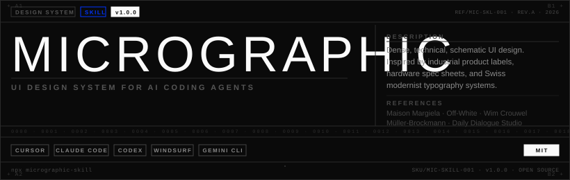

<div align="center">
  
</div>

<br/>

<div align="center">

[](https://www.npmjs.com/package/micrographic-skill)
[](./LICENSE)
[](https://github.com/albegosu/micrographic-skill)

</div>

---

A `SKILL.md` for AI coding agents that instructs them to build **dense, technical, schematic UI** — inspired by industrial product labels, hardware spec sheets, care instructions, and Swiss modernist typography.

Think Maison Margiela's inner labels, Virgil Abloh's Off-White graphics, and Wim Crouwel's grid systems — as a production-ready design system your agent follows automatically.

> **This is not minimalism. Minimalism removes. Micrographic *compresses*.**  
> Every element earns its place. Information becomes decoration.

---

## Install

Run inside any project. The installer auto-detects which agent you have set up and drops the skill in the right place.

```bash
npx micrographic-skill
```

**Target a specific agent:**

```bash
npx micrographic-skill --cursor      # → .cursor/skills/micrographic/SKILL.md
npx micrographic-skill --claude      # → .claude/skills/micrographic/SKILL.md
npx micrographic-skill --all         # → all detected agents at once
```

**Optional — install as a Cursor always-on rule** (applies to every UI task in the project):

```bash
npx micrographic-skill --rules       # → .cursor/rules/micrographic.mdc
```

**Preview without writing:**

```bash
npx micrographic-skill --dry-run
```

---

## Usage

After installing, prompt your agent naturally. The skill activates when it detects relevant intent:

```
"build me a micrographic product card"
"create a dashboard — dense, technical, spec-sheet style"
"I want the UI to feel industrial, like a hardware label"
"use the micrographic skill for this landing page"
```

---

## What your agent will produce

The skill encodes a complete design system — your agent follows it to generate CSS and HTML that is consistent across every component it builds.

| Token | Value | Purpose |
|---|---|---|
| `--text-micro` | `8px` | Decorative annotations only |
| `--text-xs` | `10px` | Tags, meta labels |
| `--text-xl` | `32px` | Display numerals |
| `--text-2xl` | `56px` | Hero figures |
| `--color-accent` | `#0033FF` | One hit per screen |
| `--border` | `1px solid #D4D4D4` | Zone skeleton |
| `--border-dark` | `1px solid #2A2A2A` | Component boundary |
| `border-radius` | `0–2px` | Angular only |

**Typography:** `Barlow Condensed` (display) + `IBM Plex Mono` (data, annotations)  
**Palette:** Near-monochromatic — black, white, five grays, one accent  
**Spacing:** 4px micro-grid (`4 / 8 / 12 / 16 / 24 / 32px`)  
**Decoration:** Registration marks `+`, reference codes `REF-0042-A`, serial number strips, grid coordinates `A1`

---

## Supported agents

| Agent | Skills path | Rules path |
|---|---|---|
| [Cursor](https://cursor.com) | `.cursor/skills/micrographic/` | `.cursor/rules/micrographic.mdc` |
| [Claude Code](https://claude.ai/code) | `.claude/skills/micrographic/` | — |
| [Codex](https://openai.com/codex) | `.codex/skills/micrographic/` | — |
| [Windsurf](https://codeium.com/windsurf) | `.windsurf/skills/micrographic/` | — |
| [Gemini CLI](https://ai.google.dev) | `.gemini/skills/micrographic/` | — |

---

## Install paths at a glance

```
your-project/
├── .cursor/
│   ├── skills/
│   │   └── micrographic/
│   │       └── SKILL.md       ← loaded dynamically when relevant
│   └── rules/
│       └── micrographic.mdc   ← always-on (--rules flag)
├── .claude/
│   └── skills/micrographic/SKILL.md
└── ...
```

---

## Aesthetic references

The micrographic aesthetic has deep roots — from Swiss Modernism to contemporary fashion branding:

- **Maison Margiela** — inner garment labels as typographic art
- **Virgil Abloh / Off-White** — industrial graphics as high fashion
- **Raf Simons** — dense label typography as branding
- **Wim Crouwel** — Swiss grid systems and schematic type
- **Josef Müller-Brockmann** — information design as visual structure
- **Daily Dialogue Studio** — contemporary micro-graphic branding

---

## Releases

Every [npm](https://www.npmjs.com/package/micrographic-skill) version has a matching Git tag `vMAJOR.MINOR.PATCH` on this repository.

```bash
npm run release:patch   # or release:minor / release:major — bumps version, commits, creates tag v…
git push --follow-tags origin main
npm publish           # add --otp=… if you use 2FA
```

---

## Contributing

Pull requests are welcome. Please read [CONTRIBUTING.md](./CONTRIBUTING.md) for language expectations (English), branch workflow, and a short checklist.

```bash
git clone https://github.com/albegosu/micrographic-skill.git
cd micrographic-skill
# edit SKILL.md
# test locally: node bin/install.mjs --dry-run && node bin/install.mjs --cursor
```

---

## License

MIT — [alberto@resiz.es](mailto:alberto@resiz.es)

<br/>

<div align="center">
  <sub><code>REF/MIC-SKL-001 · REV.A · 2026 · SKU/OPEN-SOURCE</code></sub>
</div>
